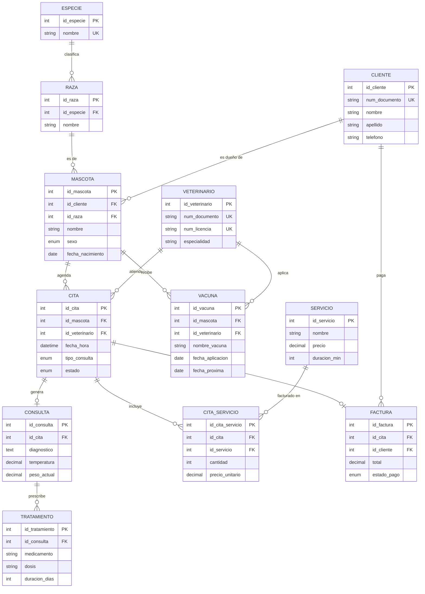

# 🐾 Clínica Veterinaria — Base de Datos (Gestión de Citas)

Modelo de base de datos para una **clínica veterinaria**, centrado en la **gestión de citas**: dueños y sus mascotas, veterinarios, agenda de citas, registro clínico (consultas, tratamientos, vacunas), servicios y facturación.

El repositorio incluye el **diagrama entidad-relación** (editable) y el **script SQL** listo para crear la base de datos.

---

## 📁 Contenido del repositorio

| Archivo | Descripción |
|---------|-------------|
| [`clinica_veterinaria_citas.drawio`](clinica_veterinaria_citas.drawio) | Diagrama entidad-relación (ER), editable en [draw.io / diagrams.net](https://app.diagrams.net) |
| [`clinica_veterinaria_citas.sql`](clinica_veterinaria_citas.sql) | Script DDL para crear la base de datos en **MySQL / MariaDB** (incluye datos de ejemplo) |

---

## 🗺️ Diagrama entidad-relación



> El diagrama de arriba se genera automáticamente en GitHub. Para la versión detallada y editable, abre el archivo `.drawio`.

---

## 🗂️ Modelo de datos (12 tablas)

| Grupo | Tabla | Para qué sirve |
|-------|-------|----------------|
| 🟩 Catálogos | `especie` | Tipos de especie (canino, felino, ave…) |
| 🟩 Catálogos | `raza` | Razas, ligadas a una especie |
| 🟦 Entidades | `cliente` | Dueños de las mascotas |
| 🟦 Entidades | `veterinario` | Profesionales que atienden |
| 🟦 Entidades | `mascota` | Pacientes (pertenecen a un cliente y una raza) |
| 🟨 Núcleo | `cita` | **Agenda de citas** (mascota + veterinario + fecha/estado) |
| 🟧 Clínico | `consulta` | Registro clínico de la cita (1:1 con `cita`) |
| 🟧 Clínico | `tratamiento` | Medicación prescrita en la consulta |
| 🟧 Clínico | `vacuna` | Vacunas aplicadas a la mascota |
| 🟪 Servicios | `servicio` | Catálogo de servicios (consulta, vacunación, cirugía…) |
| 🟪 Servicios | `cita_servicio` | Servicios realizados/facturados en una cita (N:M) |
| 🟥 Facturación | `factura` | Factura asociada a la cita (1:1) |

### Relaciones clave
- Un **cliente** tiene muchas **mascotas**; una **mascota** pertenece a una **raza** (y esta a una **especie**).
- Una **mascota** agenda muchas **citas**; cada **cita** la atiende un **veterinario**.
- Cada **cita** genera una **consulta** (1:1) y una **factura** (1:1).
- Una **consulta** puede derivar en varios **tratamientos**.
- Una **cita** puede incluir varios **servicios** (relación N:M vía `cita_servicio`).

---

## 🖼️ Abrir / editar el diagrama (`.drawio`)

Cualquiera de estas opciones:

- **Web:** entra a [app.diagrams.net](https://app.diagrams.net) → *File → Open From → Device* → elige `clinica_veterinaria_citas.drawio`.
- **VS Code:** instala la extensión *Draw.io Integration* (`hediet.vscode-drawio`) y abre el archivo.
- **Escritorio:** app [draw.io Desktop](https://github.com/jgraph/drawio-desktop/releases).

---

## 🛠️ Crear la base de datos (`.sql`)

**Requisitos:** MySQL 8+ o MariaDB 10.x.

El script ya crea la base `clinica_veterinaria` (UTF-8 `utf8mb4`), todas las tablas con sus llaves e índices, y carga algunos datos de ejemplo.

### Opción A — Línea de comandos
```bash
mysql -u root -p < clinica_veterinaria_citas.sql
```

### Opción B — Interfaz gráfica
En **MySQL Workbench**, **DBeaver** o **phpMyAdmin**: abre `clinica_veterinaria_citas.sql` y ejecútalo completo.

### Comprobar
```sql
USE clinica_veterinaria;
SHOW TABLES;          -- 12 tablas
SELECT * FROM servicio;
```

---

## 🔑 Convenciones

- **PK** = llave primaria (autoincremental). **FK** = llave foránea. **UK** = valor único.
- Estados de la cita: `PROGRAMADA`, `CONFIRMADA`, `EN_CURSO`, `ATENDIDA`, `CANCELADA`, `NO_ASISTIO`.
- Estado de pago de la factura: `PENDIENTE`, `PAGADA`, `ANULADA`.
- Tipos de documento (Colombia): `CC`, `CE`, `TI`, `PAS`, `NIT`.

---

## 🚀 Posibles ampliaciones

- Inventario de medicamentos/insumos y su descuento al facturar.
- Horarios/disponibilidad del veterinario (agenda con bloques de tiempo).
- Multi-sede (sucursales) y usuarios/roles del sistema.
- Recordatorios de próxima vacuna o control.

---

*Autora: Norma Constanza Olaya Rincón.*
